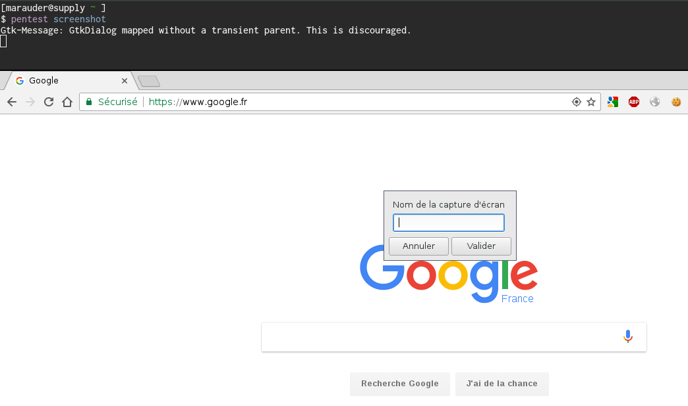

.. These are the Travis-CI and Coveralls badges for your repository. Replace
   your *github_repository* and uncomment these lines by removing the leading
   two dots.

.. .. image:: https://travis-ci.org/*github_repository*.svg?branch=master
    :target: https://travis-ci.org/*github_repository*

.. .. image:: https://coveralls.io/repos/github/*github_repository*/badge.svg?branch=master
    :target: https://coveralls.io/github/*github_repository*?branch=master

======
Jarvis
======

Jarvis is a very simple pentest companion that provides the following features:

* penetration tests results directory management
* unified structure for all assessments
* hooks for useful commands and automated output saving
* unified command history file
* easy way to take screenshots
* creation of an easily reachable symlink that always point to your current pentest

It is fully written in Python and is designed to be easily extended.

**This project is currently under development and many bugs may appear, do not hesitate to open issues or submit pull requests**

Command hooking
===============

As a pentester, I often faced with difficulties related to output recording. Sometimes, a very looonnnng ``nmap`` scan launched without output options and cancelled may be very painful due to the lack of exploitable files. I'm not even talking about closed terminals containing juicy outputs that may lack in a security assessment report.

For these reasons, I decided to implement a command hooking feature that would automatically add output options to command lines and record outputs if such options would not exist.

Basically, each command exposed by Jarvis is a specific method called on a Python class. This method retrieves the supplied command line, adds arguments and patches the command lines, and finally runs the built command in a patched environnement.

Installation
============

See `install`_

.. _install: INSTALL.rst

Usage
=====

Initial configuration
---------------------

For using Jarvis, you will have to fill a ``/etc/jarvis.conf`` file::

	[jarvis]
	pentests_history = /home/user/.pentests_history
	user_directory = user
	output_directory = records
	img_directory = img
	pentest_tree = [
		"%(user_directory)s",
		"%(user_directory)s/img",
		"%(user_directory)s/scripts",
		"%(user_directory)s/records"
		]
	notesfiles = notes.txt
	interface = eth0
	editor = vim

Here is a quick description of available options (all of them are mandatory):

* ``pentests_history`` : path to the file that will contain all the paths to performed pentests
* ``user_directory`` : since a pentest is supposed to be performed by several persons, this is the name of your directory within the pentest's one
* ``output_directory`` : the directory within your user's directory that will contain all records produced by available hooks
* ``img_directory`` : the directory within your user's directory that will contain screenshots
* ``pentest_tree`` : this is a very important configuration, it describes the structure of your pentest directory that will be created after a ``pentest init``. For the moment, I'm too lazy for creating directories according to previously described options so the directory tree must be fully described in this setting. This advanced feature should come soon. Note that some commands will obviously fail if you do not create ``user_directory`` or ``output_directory``
* ``notesfiles`` : the file that will be used for taking notes
* ``interface`` : the network interface through which test are going to be performed
* ``editor`` : your preferred editor (``vim``, ``emacs``, whatever)

Pentest directory management
----------------------------

If you want to start a new pentest, run the following commands::

	$ pentest start /path/to/pentest
	$ pentest init

The first command will append an entry inside the pentests history file. The second will create your pentest directory structure.

After init, the pentest directory is created::

	$ tree /path/to/pentest
	/path/to/pentest
	└── user
	    ├── img
	    ├── records
	    └── scripts

Note that pentests are *stacked* in the ``pentests_history`` file::

	$ cat .pentests_history 
	/tmp/pentest-1
	/tmp/pentest-2
	/tmp/pentest-3

Stopping a pentest with ``pentest stop`` will simply *pop* the last entry from the history file.

You can then define useful aliases. The most explicit example is *jumping* to the current pentest with a bash alias::

	alias gopentest="cd $(tail -n 1 /path/to/.pentests_history)"

Command hooking
---------------

Jarvis is shipped with many commands hooks that can be listed::

	$ pentest hooks
	airodump
	arpscan
	crackmapexec
	curl
	dnsmap
	dnsrecon
	hping3
	http
	hydra
	nikto
	nmap
	patator
	smbclient
	smbmap
	sslyze
	wfuzz

Please note that Jarvis **does not** ships packages providings hookable scripts or binaries. Jarvis also expects that each hooked command should runnable as-is. Basically, *wfuzz* should be callable without Jarvis installed.

	Currently, Jarvis throws an exception with the underlying command does not exist on the installed system

Let's try running an ``nmap`` scan, which is one of the currently available hooks::

	$ nmap 127.0.0.1

	Starting Nmap 7.12 ( https://nmap.org ) at 2017-04-25 21:59 CEST
	Nmap scan report for localhost.localdomain (127.0.0.1)
	[...]

Now, the ``commands.log`` file is populated::

	$ cat commands.log 
	[192.168.1.51] 2017-04-25 22:04:31,507 :: 'nmap' '-oA' '/tmp/assessment/marauder/records/nmap-127.0.0.1-2017-04-25-220431' '127.0.0.1'

You can see that output options have been added, and output files created automatically::

	$ ls records/
	nmap-127.0.0.1-2017-04-25-220347.gnmap  nmap-127.0.0.1-2017-04-25-220347.xml
	nmap-127.0.0.1-2017-04-25-220347.nmap

Output files naming follows a basic format. Note that naming is really efficient when **targets** are placed at **regular** positions. For example, ``nmap`` will process the target independantly from its position within the command line. This is achieved through a huge parsing effort on the command line that I don't want to reimplement in Python and for each hook. Thus, it is recommend to put the target **at the end of the command line** when tools are agnostic about its position.

Finally, it should be highlighted that some command line arguments automatically disable the hooking mechanism. Especially, when help is invoked (``-h`` or ``--help``), or when output options are passed (basically ``-oJ``, ``-oA`` or whatever in ``nmap``), hooking is not performed.

Disable hooking at runtime
--------------------------

Sometimes, many **many** commands are typed and recording is not especially needed. Jarvis allows users to circumvent the hooking mechanism by using the ``--nojarvis`` option. This option will be consumed by Jarvis witout consequences on subsequent commands.

Screenshots
-----------

Taking screenshot is also made easy with ``pentest screenshot``. This command will run the Imagemagick ``import`` command with manual selection options. Once the screenshot is taken, you are prompted for a screenshot name (I used ``zenity`` for this purpose):

I recommend associating this command to a keybinding :-)

You can then list your screenshots::

	$ pentest img
	screen-1.png
	screen-2.png
	
And edit any screenshot with ``pinta``, which is one of the most convenient *quickwin* editor from my point of view::

	$ pentest edit screen-1.png

Adding a new hook
=================

TODO

Extending Jarvis
================

Jarvis is mainly a python module that can be used for various purposes based on pentest needings. The `sharify`_ script was developed for saving files efficiently when crawling CIFS share. Usually you do::

	$ smbclient -U "domain\user%password" //host/share
	cd directory
	get file

``file`` is then stored in the same directory from which you ran ``smbclient``. ``sharify`` consumes the Jarvis setup to drop downloaded files in the ``files`` directory within your current pentest directory::

	$ sharify -u USERNAME -p PASSWORD -d DOMAIN //host/share
	cd directory
	get file
	
	$ tree /path/to/pentest/<user>/files
	/path/to/pentest/<user>/files
	└── host
	    ├── share1
	    │   ├── file-1
	    │   └── file-2
	    └── share2
		├── file-1
		└── file-2	

.. _sharify: https://github.com/BastienFaure/jarvis/blob/master/tools/sharify
